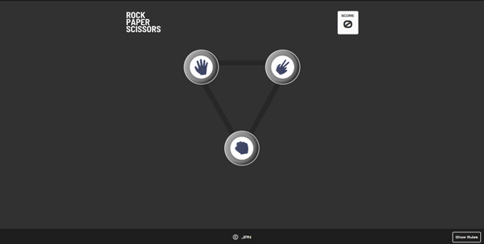
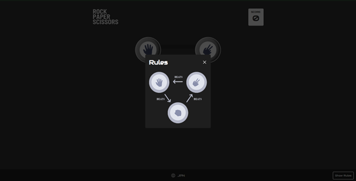
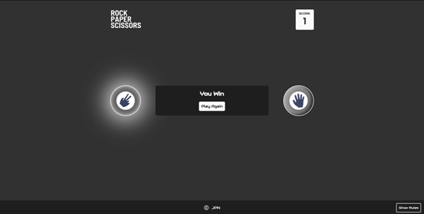

# Rock-Paper-Scissors Game App

## Description

This is a simple and interactive React based Rock-Paper-Scissors game that allows the user to play the game against the computer. The game aims to be fun and engaging and also tries to test the users decision-making skills and luck.

## Features

- User selection: the game allows the user to select one of the three signs used for rock-paper-scissors.
- Random AI: the computer uses a randomizing function, randomly selecting on of the signs from the list.
- Score tracking: the users score will increase by one for each victory, and will decreas by 1 for each loss. Should the game be a tie, no points are scored.
- Rule display: the user can check the rules of the game, which will display which sign beats which.
- Responsive design for seamless gameplay on different devices.

## Live demo

You can try out the Rock-Paper-Scissors Game by visiting the [live demo](https://zack1808.github.io/rock-paper-scisors/)

## How to run the app

If you want to run the app localy:

#### 1. Clone the repository

- HTTPS: `git clone https://github.com/Zack1808/rock-paper-scisors.git`
- SSH: `git clone git@github.com:Zack1808/rock-paper-scisors.git`
- GitHub CLI: `gh repo clone Zack1808/rock-paper-scisors`

#### 2. Enter the project directory

`cd rock-paper-scisors`

#### 3. Allow the app to install the necessary packages (Node.js has to be installed on the device)

`npm install`

#### 4. Start the app

`npm start`

After execution, the localhost server will startup and a browser window will open, previewing the Rock-Paper-Scissors app.

## Contributions

Contributions to the Rock-Paper-Scissors project are welcome. If you find any issues or want to add new features, feel free to create a pull request. Make sure to follow the project's coding conventions and provide detailed information about your changes.

## Contact

If you have any questions or suggestions, you can reach me via:

- Mail: jeanpierrenovak23@gmail.com
- My portfolio: [jeanpierrenovak.netlify.app](https://jeanpierrenovak.netlify.app)
